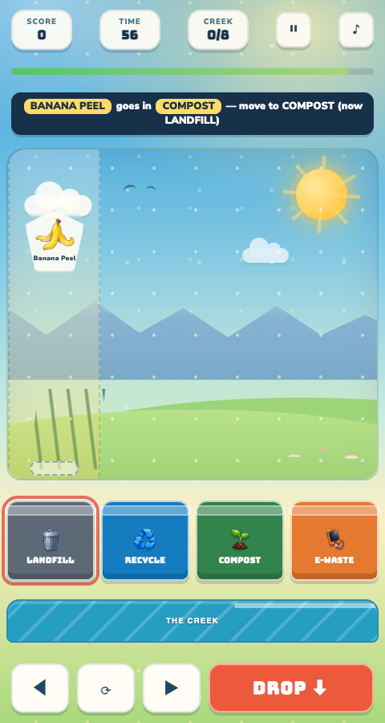

# Sort Rush: Save the Creek



A fast, kid-friendly browser sorting game. Trash falls from the sky and you steer
each piece into the right bin — Landfill, Recycling, Compost, or E-Waste — before
it pollutes the creek. Later pieces must also be rotated until they glow green to
fit. Sort correctly to score and build combos; 8 misses pollutes the creek and
ends the run, or survive the 90-second timer to save it.

## How to play

- Move with ◀ ▶ buttons, arrow keys, or by dragging the piece. Hold to keep moving.
- Rotate with ⟳ (or tap the piece) until it glows green.
- Sort by tapping a bin, pressing DROP ⬇ / Space, or releasing a drag over a bin.
- Press HOW TO PLAY in the game for the interactive tutorial.

## Run it

Open `index.html` in a browser, or serve it locally:

```sh
python3 -m http.server --directory .
```

Then visit `http://localhost:8000`.

## Android APK

```sh
cd android && ./gradlew assembleDebug
```

Output is at `android/app/build/outputs/apk/debug/app-debug.apk` or `SortRush.apk`.

